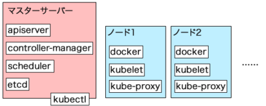
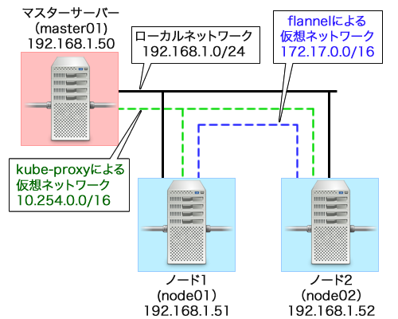

### kubernetesを構成するコンポーネント

| コンポーネント名   | 説明                                                         |
| ------------------ | ------------------------------------------------------------ |
| apiserver          | kubernetesを操作するためのAPIを提供する                      |
| controller-manager | コンテナの状態管理やノードの管理と言った各種管理作業を行う   |
| proxy              | コンテナへのネットワークルーティングおよび負荷分散を行う     |
| scheduler          | 各ノードに対しコンテナの割り当てなどを行う                   |
| kubelet            | 各ノード上でのコンテナ作成/削除やボリュームの割り当てなどを行う |
| kubectl            | API経由でKubenetesを操作するためのクライアントツール         |

###  kubernetesの基本的な構成図




### Kubernetesサンプル




### リソースオブジェクト

| 名称       | 説明                                           |
| ---------- | ---------------------------------------------- |
| Pod        | 使用するコンテナや実行するプログラムを定義する |
| Deployment | Podの管理方法を定義する                        |
| Job        | 非定常的に処理を実行するジョブを定義する       |
| CronJob    | 定期的に実行されるジョブを定義する             |
| Service    | ネットワークサービスを定義する                 |
| ConfigMap  | コンテナで使用される各種設定リソースを定義する |
| Secret     | コンテナで使用される各種設定リソースを定義する |
| Volume     | コンテナに割り当てるストレージを定義する       |
| Namespace  | 管理のための名前空間を定義する                 |


## Yaml

### ワークロード
- #### Pod
``` yaml
apiVersion: v1
kind: Pod
metadata:
  name: sample
spec:
  containers:
  - name: nginx
    image: nginx:1.17.2-alpine
    volumeMounts:
    - name: storage
      mountPath: /home/nginx
  volumes:
  - name: storage
    hostPath:
      path: "/data/storage"
      type: Directory
```

- #### ReplicaSet

``` yaml {.line-number .copy}
apiVersion: apps/v1
kind: ReplicaSet
metadata:
  name: nginx
spec:
  replicas: 3
  selector:
    matchLabels:
      app: web
      env: study
  template:                   # Podと同じものを記述
    metadata:
      name: nginx
      labels:
        app: web
        env: study
    spec:
      containers:
      - name: nginx
        image: nginx:1.17.2-alpine

```

- #### Deployment

```yaml
apiVersion: apps/v1
kind: Deployment
metadata:
  name: nginx
  annotations:
    kubernetes.io/change-cause: "First release."
spec:
  replicas: 2
  selector:
    matchLabels:
      app: web
      env: study
  revisionHistoryLimit: 14    # デフォルト 10
  strategy:
    type: RollingUpdate
    rollingUpdate:
      maxSurge: 1             # 余分に生成してよいPod数
      maxUnavailable: 1       # 一度に消失してよいPod数
  template:
    metadata:
      name: nginx
      labels:
        app: web
        env: study
    spec:
      containers:
      - name: nginx
        image: nginx:1.17.2-alpine
```

- #### StatefulSet

```yaml
apiVersion: apps/v1
kind: StatefulSet
metadata:
  name: nginx
spec:
  replicas: 1
  selector:
    matchLabels:
      app: web
      env: study
  revisionHistoryLimit: 14
  serviceName: sample-svc     # HeadlessServiceと紐づける
  template:
    metadata:
      name: nginx
      labels:
        app: web
        env: study
    spec:
      containers:
      - name: nginx
        image: nginx:1.17.2-alpine
        volumeMounts:
        - name: storage
          mountPath: home/nginx
  volumeClaimTemplates:       # PersistentVolumeClaimと同じものを記述
  - metadata:
      name: storage
    spec:
      storageClassName: slow
      accessModes:
      - ReadWriteMany
      resources:
        requests:
          storage: 1Gi
```

### サービス

- #### Service

```yaml
apiVersion: v1
kind: Service
metadata:
  name: web-svc
spec:
  type: NodePort              # ClasterIP(デフォルト), NodePort, LoadBalancer, ExternalName
  selector:
    app: web
    env: study
  ports:
  - port: 80                  # 受付ポート
    targetPort: 80            # 転送先ポート
    nodePort: 30000           # ノード上にマッピングするポート（type: NodePort 時のみ）
```

- #### Ingress

```yaml
apiVersion: networking.k8s.io/v1beta1
kind: Ingress
metadata:
  name: frontend
  annotations:
    kubernetes.io/ingress.class: "nginx"
    nginx.ingress.kubernetes.io/ssl-redirect: "false"
spec:
  rules:
  - http:
      paths:
      - path: /
        backend:
          serviceName: web-svc
          servicePort: 80
```

### 設定

- #### ConfigMap

```yaml
apiVersion: v1
kind: ConfigMap
metadata:
  name: sample-config
data:
  sample.cfg: |
    user: tsuyoshi.tanaka
  type: "application"
```

- #### Secret

```yaml
apiVersion: v1
kind: Secret
metadata:
  name: sample-secret
data:
  message: SGVsbG8gV29ybGQgIQ==     # echo -n 'Hello World !' | base64
  keyfile: WU9VUi1TRUNSRVQtS0VZ     # cat ./keyfile | base64
```

### ストレージ

- #### PersistentVolume

```yaml
apiVersion: v1
kind: PersistentVolume
metadata:
  name: volume-01
  labels:
    env: study
spec:
  storageClassName: slow
  accessModes:
  - ReadWriteOnce                   # ReadWriteOnce, ReadOnlyMany, ReadWriteMany
  capacity:
    storage: 1Gi
  persistentVolumeReclaimPolicy: Retain   # Retain, Delete, Recycle(非推奨)
  hostPath:
    path: "/data/storage"
    type: Directory
```


- #### PersistentVolumeClaim

```yaml
apiVersion: v1
kind: PersistentVolumeClaim
metadata:
  name: volume-claim
  labels:
    env: study
spec:
  storageClassName: slow
  accessModes:
  - ReadWriteOnce
  resources:
    requests:
      storage: 1Gi
```

